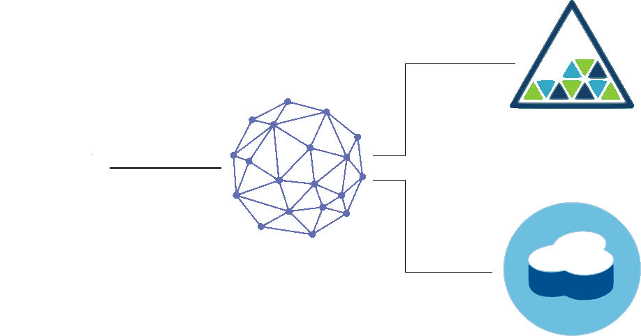

# Mobile Backend for Bluemix

### IBM Backend for Frontend
The Backend for Frontend uses a  **LoopBack** Node.js runtime with the **Cloudant NoSQL DB**, **Object Storage**, **Mobile Client Access**, **Push Notifications**, and **Mobile Analytics** services on Bluemix. The template exhibits common architectural design patterns that developers can use to model their backend on Bluemix to support integration for an omnichannel application. It has the the ability to browse a list of products and supports the viewing of images for each item in the product list.

The backend uses the following Bluemix services and runtime:

**Runtime**
* **LoopBack** for Swagger exposure and REST integration with Node.js

**Services**
* **Cloudant NoSQL DB** to hold a list products in a NoSQL database
* **Object Storage** to store product images
* **Mobile Client Access** for protecting resources using authentication
* **Push Notifications** for sending notifications to customers
* **Mobile Analytics** for monitoring trends and performance of the application

> **Note:** Currently the **Object Storage** service is not available in the Sydney, so this template is not operable in that region.

### Data architecture

## Configuring the Backend

The backend can be easily installed using the **bluegen** command line tool. This CLI tool logs you into Bluemix and prepares the backend services for use. It automatically provisions the services and populates them with the test data required to get up to speed quickly.

### Before you begin
Ensure that you have:

* The [Cloud Foundry CLI](https://github.com/cloudfoundry/cli) installed
* The [Bluemix Generator CLI tool](https://www.npmjs.com/package/bluemix-generator) installed by typing the command:

	`npm install -g bluemix-generator`

> **Note:** If you have issues installing these packages globally, it is likely an issue with your permissions. See the [official npm instructions for how to fix permission issues](https://docs.npmjs.com/getting-started/fixing-npm-permissions) in their **Getting Started**.

### Create your backend from this template

1. First, clone this project into your working directory:

	`git clone https://github.com/ibm-bluemix-mobile-services/backend-for-frontend-node.git`

2. Run the following command in the root directory of your cloned project. This will create the required services on Bluemix and populate them with the necessary test data:

	`bluegen`

3. Navigate to your newly created projects folder.
4. Upload your backend to Bluemix by typing these commands:

	`cf login [-a API_URL] [-u USERNAME] [-o ORG] [-s SPACE]`

	`cf push`

   After running `cf push`, you should be able to see the application running on the Bluemix dashboard. Visiting the application route will greet you with a landing page displaying more information about this template and the ability to explore the API.

5. If you want to configure or extend your backend, you can edit the API configuration locally by running the commands:

	`npm install`

	`npm start`

6. Redeploy data to **Cloudant NoSQL DB** and **Object Storage** by running this command in your project directory:

	`bluegen`

> **Note:** At this time, you will have to restart your Bluemix application when you redeploy data to the **Cloudant NoSQL DB** database. This is because **API Connect** needs to reconnect to your datasource.

### License
This package contains sample code provided in source code form. The samples are licensed under the Apache License, Version 2.0 (the "License"). You may obtain a copy of the License at http://www.apache.org/licenses/LICENSE-2.0 and may also view the license in the license file within this package.
